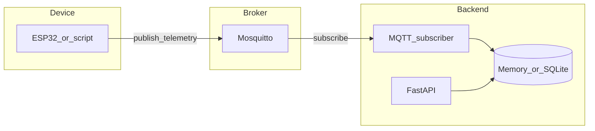

# EdgeWatch IoT

物联网数据监控平台：设备经 MQTT 上报遥测数据，后端订阅、持久化并提供 HTTP 查询，支持告警与 Web 看板。

## 你在解决什么问题

- 用最小依赖跑通 **设备 → Broker → 后端 → 查询** 全链路，便于理解 IoT 数据流。
- 用可切换的 **内存 / SQLite** 存储，从演示平滑过渡到「数据落盘」。
- 为后续 **鉴权、看板、告警** 预留接口与文档路径。

## 架构一览



## 技术栈

| 层级 | 技术 |
|------|------|
| 设备示例 | ESP32（Arduino）、PowerShell 测试脚本 |
| 消息 | MQTT（Eclipse Mosquitto） |
| 后端 | Python 3.11、FastAPI、Uvicorn、paho-mqtt |
| 存储 | 内存（默认）或 SQLite（`STORAGE_BACKEND=sqlite`） |
| 编排 | Docker Compose |

## 前置条件

- [Docker Desktop](https://www.docker.com/products/docker-desktop/)（含 `docker compose`）
- Windows 下可选：PowerShell 5+（用于测试脚本）

## 5 分钟跑通（Docker）

### 1. 启动服务

在项目根目录执行：

```powershell
docker compose up --build
```

**验收**：终端无报错；浏览器打开 [http://localhost:8000/health](http://localhost:8000/health) 返回 `{"status":"ok"}`。

### 2. 发一条测试消息

新开终端，在项目根目录：

```powershell
.\scripts\publish_test.ps1
```

**验收**：后端日志出现 `Saved telemetry for device=...`。

### 3. 查询最新一条（需要 API Key）

浏览器或 `curl`（请求头需带 `X-API-Key`，默认示例值见 `backend/.env.example`）：

```powershell
curl -H "X-API-Key: change-me-in-production" `
  http://localhost:8000/devices/demo-device/latest
```

**验收**：返回 JSON，含 `device_id` 与 `payload`（与脚本发送内容一致）。

### 4. 查询最近 N 条（可选，需要 API Key）

```powershell
curl -H "X-API-Key: change-me-in-production" `
  "http://localhost:8000/devices/demo-device/recent?limit=5"
```

**验收**：`items` 为数组；默认 `limit=10`，最大 `100`。

---

### 持久化（SQLite，Compose 内）

默认 [backend/.env.example](backend/.env.example) 中已配置 `STORAGE_BACKEND=sqlite` 与数据卷，重启容器后历史仍可查 `recent`（在保留条数内）。

**验收**：`docker compose down` 后再 `up`，对同一 `device_id` 调用 `recent` 仍能看到此前写入（未超保留策略前）。

## 项目结构

```text
edgewatch-iot
├── backend                 # FastAPI + MQTT 订阅
│   ├── app
│   │   ├── main.py
│   │   ├── mqtt_worker.py
│   │   └── storage.py
│   ├── tests
│   ├── .env.example
│   ├── Dockerfile
│   ├── requirements.txt
│   └── requirements-dev.txt
├── firmware/esp32_mqtt_template
├── mosquitto/config
├── scripts/publish_test.ps1
├── .github/workflows/ci.yml
├── docs/EXTENSIONS.md      # 鉴权、看板、告警分步路线
└── docker-compose.yml
```

## API 摘要

| 方法 | 路径 | 说明 |
|------|------|------|
| GET | `/health` | 存活探针 |
| GET | `/devices/{device_id}/latest` | 该设备最新一条遥测（需 `X-API-Key`） |
| GET | `/devices/{device_id}/recent?limit=10` | 该设备最近 `limit` 条（1–100，需 `X-API-Key`） |

### 示例响应

`GET /devices/demo-device/latest`：

```json
{
  "device_id": "demo-device",
  "payload": {
    "temperature": 25.6,
    "humidity": 48.2,
    "ts": 1714464000
  }
}
```

`GET /devices/demo-device/recent?limit=2`：

```json
{
  "device_id": "demo-device",
  "limit": 2,
  "items": [
    {
      "device_id": "demo-device",
      "payload": { "temperature": 25.6, "humidity": 48.2, "ts": 1714464000 }
    }
  ]
}
```

## 环境变量

见 [backend/.env.example](backend/.env.example)。常用项：

| 变量 | 说明 |
|------|------|
| `MQTT_HOST` / `MQTT_PORT` | Broker 地址与端口 |
| `MQTT_TOPIC` | 订阅主题，默认 `iot/devices/+/telemetry` |
| `API_KEY` | 访问 `/devices/...` 接口的请求头密钥（`X-API-Key`） |
| `STORAGE_BACKEND` | `memory` 或 `sqlite` |
| `SQLITE_PATH` | SQLite 文件路径（sqlite 时） |
| `DISABLE_MQTT` | `1` 时不在进程内启动 MQTT（本地跑测试用） |

## 本地开发（不依赖 Docker）

```powershell
cd backend
python -m venv .venv
.\.venv\Scripts\Activate.ps1
pip install -r requirements.txt
$env:MQTT_HOST="localhost"
$env:API_KEY="change-me-in-production"
$env:STORAGE_BACKEND="memory"
python -m uvicorn app.main:app --reload --host 0.0.0.0 --port 8000
```

需本机已启动 Mosquitto 且与 `MQTT_HOST` 一致。

## 测试与质量

```powershell
cd backend
pip install -r requirements.txt -r requirements-dev.txt
$env:DISABLE_MQTT="1"
pytest -q
```

CI：推送/PR 时在 GitHub Actions 运行相同测试（见 [.github/workflows/ci.yml](.github/workflows/ci.yml)）。

## ESP32 与 Topic 约定

- **Topic**：`iot/devices/<device_id>/telemetry`
- **Payload**：JSON 对象，例如：

```json
{
  "temperature": 25.6,
  "humidity": 48.2,
  "ts": 1714464000
}
```

固件示例：[firmware/esp32_mqtt_template/esp32_mqtt_template.ino](firmware/esp32_mqtt_template/esp32_mqtt_template.ino)

## 常见问题

| 现象 | 处理 |
|------|------|
| 端口 8000 / 1883 被占用 | 修改 `docker-compose.yml` 端口映射或结束占用进程 |
| `/devices/.../latest` 404 | 确认已发 MQTT 且 Topic 形如 `iot/devices/<id>/telemetry`，且 Payload 为 JSON 对象 |
| 后端连不上 MQTT | 检查 `MQTT_HOST`：Compose 内应为 `mosquitto`；本机直连应为 `localhost` |
| SQLite 权限错误 | 确保 `SQLITE_PATH` 父目录存在且可写（镜像内默认 `/app/data`） |

## 面试 1 分钟讲解稿（可参考）

1. **背景**：这是一个 IoT 数据管道演示，设备用 MQTT 发遥测，后端订阅后写入存储，再用 REST 对外查询。  
2. **技术点**：FastAPI 生命周期里挂 MQTT 客户端；存储抽象成接口，默认内存、可选 SQLite，方便以后换时序库。  
3. **可验证**：Compose 一键起，脚本发消息，浏览器能查到 `latest` 和 `recent`。  
4. **后续**：鉴权（设备证书或 API Key）、PostgreSQL/TimescaleDB、看板与告警；详见 [docs/EXTENSIONS.md](docs/EXTENSIONS.md)。

## 路线图（建议学习顺序）

1. 跑通 Docker + 测试脚本，理解 Topic 与 Payload。  
2. 对比 `memory` 与 `sqlite` 行为，阅读 `storage.py` 抽象。  
3. 阅读 [docs/EXTENSIONS.md](docs/EXTENSIONS.md)，选一条（鉴权 / 历史库 / 看板）做下一迭代。  
4. 为每条迭代补测试与 README 片段，保持可演示。

---

欢迎你在 Issues 或笔记里记录「踩坑与改进」，这也是作品集加分项。
